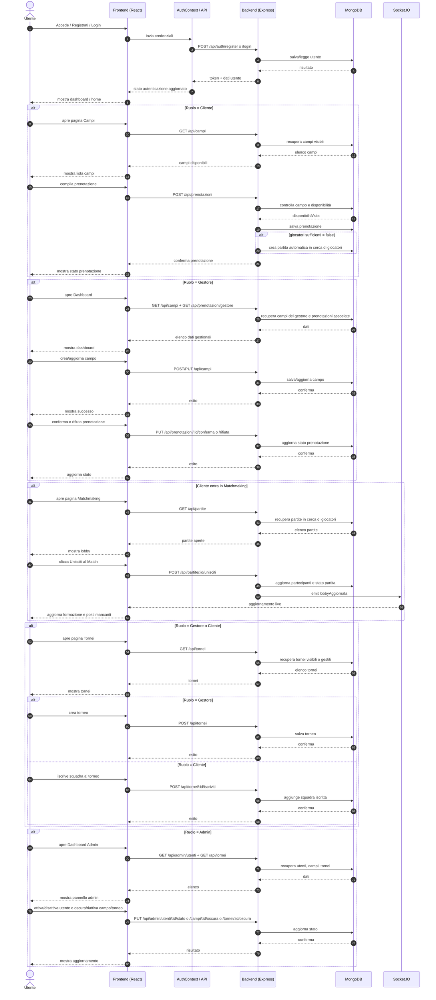

# Diagramma di sequenza - Mixed-Zone Web App

## Panoramica funzionale
La web app consente a tre tipologie di utenti di interagire con una piattaforma sportiva:
- Cliente: registrazione, login, visualizzazione campi, prenotazione, matchmaking, iscrizione ai tornei.
- Gestore: gestione campi, gestione prenotazioni, creazione tornei, aggiornamento classifiche e risultati.
- Admin: moderazione utenti, campi e tornei.

## Diagramma Mermaid

## Riepilogo dei flussi descritti
- Autenticazione e autorizzazione basata su JWT.
- Prenotazione di campi da parte dei clienti.
- Gestione delle prenotazioni da parte dei gestori.
- Matchmaking in tempo reale con Socket.IO.
- Gestione tornei e classifiche.
- Moderazione amministrativa centralizzata.